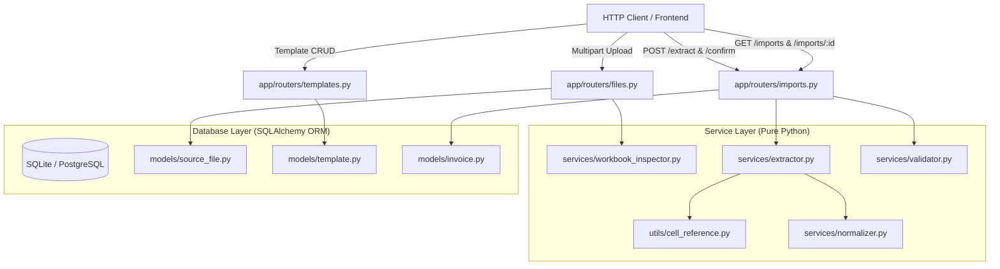
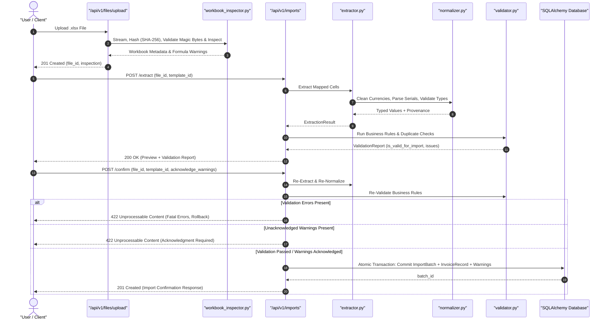

# DataBridge

**Configurable Business Data Ingestion & Validation Platform**

DataBridge is a backend data ingestion and validation service designed to solve a common operational challenge: importing business data from inconsistent, custom-formatted Excel spreadsheets into clean, validated, and structured formats.

---

## 1. Overview & Problem Statement

Organizations frequently receive transactional documents (such as invoices, purchase orders, and supplier statements) as Excel workbooks. Each supplier, vendor, or internal department often uses a different layout:

* **Varying cell coordinates:** Key values such as *Invoice Number* or *Total Amount* appear in different cells (`B3` vs. `D6` vs. `F2`).
* **Inconsistent formatting:** Numerical values contain currency symbols, commas, or accounting parentheses (`RM 1,250.50`, `($500.00)`, `1250.50-`).
* **Diverse date representations:** Dates appear as ISO strings (`2026-09-22`), localized formats (`22/09/2026`), or raw Excel numeric date serials (`45557`).
* **Mixed worksheet structures:** Files contain multiple sheets, hidden audit sheets, or uncalculated formula cells.

Conventional approaches rely on brittle custom scripts or manual data entry. **DataBridge** solves this by decoupling file ingestion into a modular pipeline:

1. **Inspection:** Safely reads workbook metadata, sheet visibility, and formula indicators.
2. **Template-Driven Extraction:** Reads cell targets defined in reusable configuration templates while tracking cell-level provenance.
3. **Deterministic Normalization:** Converts raw cell contents into typed Python types (`Decimal`, `date`, `int`, `str`) with explicit error handling (no silent defaulting to `0` or ignoring date conversion failures).
4. **Business Validation:** Evaluates business rules in memory, separating fatal errors (which prevent import) from business warnings (such as credit notes or future-dated invoices).
5. **API-Driven Preview:** Returns an extraction and validation diagnostic report before any data is committed to persistent storage.

---

## 2. Core Features

### Implemented Features (Milestones 1–5)

* **Safe Workbook Inspection (`workbook_inspector.py`):**
  * Validates file size, extension, and ZIP magic bytes (`PK\x03\x04`).
  * Enforces path traversal protection using sanitized UUID-based file storage.
  * Detects visible, hidden, and `veryHidden` worksheets.
  * Dual-loads workbooks (`data_only=False` and `data_only=True`) to discover formula expressions and identify uncalculated formula cells.
  * Provides bounded 2D matrix cell previews (`GET /api/v1/files/{id}/preview`).

* **Reusable Template Management (`templates.py`):**
  * Full RESTful CRUD endpoints for extraction templates.
  * Nested field mapping definitions with 1-to-many relationship and SQLite cascading deletes (`cascade="all, delete-orphan"`).
  * Validates and canonicalizes cell references (e.g. `"$b$3"` $\rightarrow$ `"B3"`).
  * Enforces uniqueness on `(template_id, field_name)` and template names (returns `409 Conflict` on duplicates).

* **Deterministic Normalization Engine (`normalizer.py`):**
  * **Financial Decimals:** Strips currency symbols (`RM`, `$`, `€`, `USD`, `£`), handles accounting negatives (`(1,250.50)` $\rightarrow$ `-1250.50`) and trailing minus signs (`1250.50-`), and validates thousands separator grouping (rejects malformed commas like `12,34.56`).
  * **Numeric Safeguards:** Rejects `NaN`, `Infinity`, and booleans. Avoids floating-point precision loss by casting floats through `Decimal(str(val))`.
  * **Epoch-Aware Dates:** Converts Excel numeric serials using the workbook's date epoch (`openpyxl.utils.datetime.from_excel`), and parses custom template formats or deterministic ISO/named-month fallbacks.
  * **Strict Failure Handling:** Raises `NormalizationError` on unparseable inputs rather than defaulting to `0` or silent `None`.

* **Provenance-Preserving Extractor (`extractor.py`):**
  * Decoupled from HTTP and database layers (pure Python service).
  * Records cell-level provenance for every field (`source_worksheet`, `source_cell_ref`, `raw_value`, `is_empty_cell`, `is_formula`, `formula_expression`, `normalized_value`, and `status`).
  * Distinguishes required empty cells (`status="error"`) from optional empty cells (`status="empty_optional"`).
  * Captures uncalculated formula warnings without crashing.

* **Business Validation Layer (`validator.py`):**
  * Operates strictly in-memory without database mutations.
  * Distinguishes **Errors** (which block import eligibility) from **Warnings** (which notify the user but permit import).
  * Configurable rules for negative amounts (credit notes/refunds), zero amounts, future date tolerances, and stale dates.
  * Injected reference date (`reference_date`) for deterministic date testing.
  * Abstracted, read-only duplicate invoice checker with database error isolation.

* **Transactional Import Persistence & History (`imports.py`, `models/invoice.py`):**
  * **Atomic Transactions:** Re-extracts and re-validates data upon confirmation before opening a database transaction.
  * **Batch Hierarchy:** Creates an `ImportBatch` with parent-child relationship to `InvoiceRecord` and persisted non-fatal `ValidationErrorRecord` entries.
  * **Explicit Warning Acknowledgment:** Blocks confirmation with `422 Unprocessable Content` if warnings are present unless `acknowledge_warnings=True` is provided.
  * **History & Detail Auditing:** Provides paginated summary listing (`GET /api/v1/imports`) and full batch inspection (`GET /api/v1/imports/{batch_id}`).
  * **Safe JSON Serialization:** Stores raw cell extraction provenance and normalized payloads in JSON columns with robust serialization for `Decimal`, dates, formulas, and nulls.

---

## 3. Supported Invoice Data Fields

The current MVP focuses on standard invoice header fields:

| Field Name | Target Data Type | Supported Formats / Normalization Rules |
|---|---|---|
| `company_name` | `text` | Stripped non-empty string. Rejects whitespace-only text. |
| `invoice_number` | `text` | Stripped non-empty string. Used for duplicate checking. |
| `invoice_date` | `date` | `YYYY-MM-DD`, `DD/MM/YYYY`, `DD-Mon-YYYY`, Excel serial numbers (`45557`), or custom template format. |
| `total_amount` | `decimal` | Decimals, integers, currencies (`RM 1,250.50`, `$500.00`), accounting negatives (`(1,250.50)`). Nullable in DB for optional mappings. |
| `currency` | `text` | Optional 3-letter currency code or identifier string. |

---

## 4. System Architecture

DataBridge follows a layered architecture with strict separation between HTTP transport, database models, and pure domain business services.



### Module Responsibilities

| Directory / Module | Responsibility | Dependencies |
|---|---|---|
| `app/routers/` | FastAPI route handlers. Validate request payloads, invoke services, manage DB transactions, and return typed responses. | FastAPI, Pydantic, SQLAlchemy |
| `app/schemas/` | Pydantic request/response models. Enforces field constraints, coordinates, and import persistence schemas. | Pydantic |
| `app/models/` | SQLAlchemy ORM database models (`SourceFile`, `Template`, `TemplateFieldMapping`, `ImportBatch`, `InvoiceRecord`, `ValidationErrorRecord`). | SQLAlchemy |
| `app/services/` | Framework-agnostic business logic (`extractor.py`, `normalizer.py`, `validator.py`, `workbook_inspector.py`). | Standard Library, openpyxl |
| `app/utils/` | Low-level utilities such as `cell_reference.py` for Excel coordinate conversion. | openpyxl (utils only) |

---

## 5. Data Processing Workflow



---

## 6. Business Validation System

The validation engine categorizes issues by severity:

* **Error:** Fatal business rule violation. Sets `is_valid_for_import = False` and blocks importing.
* **Warning:** Non-fatal business anomaly. Alerts the user during preview but leaves `is_valid_for_import = True`.
* **Info:** Informational notes about extraction or optional fields.

### Standardized Validation Rule Matrix

| Rule ID | Severity | Trigger Condition |
|---|---|---|
| `REQ_FIELD_MISSING` | `error` | Required field cell is empty or missing from the workbook. |
| `EMPTY_IDENTIFIER` | `error` | Primary identifier (`company_name`, `invoice_number`) contains whitespace only. |
| `INVALID_DATA_TYPE` | `error` | Raw value failed type conversion (e.g. `"N/A"` in a decimal field, invalid date format). |
| `EXTRACTION_FAILURE` | `error` / `warning` | Missing worksheet (`error`) or uncalculated formula in required field (`error`) / optional field (`warning`). |
| `UNBOUNDED_FUTURE_DATE` | `warning` | `invoice_date` is $> 30$ days in the future relative to `reference_date`. |
| `STALE_INVOICE_DATE` | `warning` | `invoice_date` is $> 5$ years (1,825 days) in the past relative to `reference_date`. |
| `NEGATIVE_AMOUNT` | `warning` / `error` | `total_amount < 0`. Defaults to `warning` (Credit Note / Refund alert) when `allow_negative_amounts=True`; `error` when `False`. |
| `ZERO_AMOUNT` | `warning` / `error` | `total_amount == 0.00`. Defaults to `warning` when `allow_zero_amounts=True`; `error` when `False`. |
| `DUPLICATE_INVOICE` | `warning` / `error` | Duplicate `(company_name, invoice_number)` found in database. Defaults to `warning`. |

---

## 7. API Endpoints

All endpoints are prefixed with `/api/v1` (except the system health check).

### System

* **`GET /health`**
  * **Description:** Health check endpoint returning service status, app name, and version.
  * **Response:** `200 OK`
    ```json
    {
      "status": "ok",
      "app": "DataBridge API",
      "version": "0.1.0",
      "environment": "development"
    }
    ```

### Files & Workbook Inspection

* **`POST /api/v1/files/upload`**
  * **Description:** Uploads an `.xlsx` file, calculates SHA-256 checksum, verifies ZIP magic bytes, inspects worksheets, and stores the file with a secure UUID filename.
  * **Content-Type:** `multipart/form-data`
  * **Response:** `201 Created` with file metadata, worksheet visibility, and formula indicators.

* **`GET /api/v1/files/{file_id}/preview`**
  * **Description:** Returns a bounded 2D matrix of cell values from a specified worksheet.
  * **Query Parameters:** `sheet_name` (string, required), `max_rows` (1–100, default 15), `max_cols` (1–50, default 10).
  * **Response:** `200 OK` with cell grid matrix.

### Templates & Field Mappings

* **`POST /api/v1/templates`**
  * **Description:** Creates a reusable extraction template with nested field mappings.
  * **Response:** `201 Created` (`409 Conflict` if template name already exists).
  * **Sample Request:**
    ```json
    {
      "name": "Supplier A Invoice",
      "description": "Standard invoice layout for Supplier A",
      "file_type": "xlsx",
      "worksheet": "Invoice",
      "field_mappings": [
        {
          "field_name": "company_name",
          "mapping_type": "cell",
          "cell_ref": "B2",
          "is_required": true,
          "data_type": "text"
        },
        {
          "field_name": "invoice_number",
          "mapping_type": "cell",
          "cell_ref": "B3",
          "is_required": true,
          "data_type": "text"
        },
        {
          "field_name": "invoice_date",
          "mapping_type": "cell",
          "cell_ref": "F3",
          "is_required": true,
          "data_type": "date"
        },
        {
          "field_name": "total_amount",
          "mapping_type": "cell",
          "cell_ref": "D6",
          "is_required": false,
          "data_type": "decimal"
        }
      ]
    }
    ```

* **`GET /api/v1/templates`**
  * **Description:** Lists all templates with summary mapping counts.
  * **Response:** `200 OK`.

* **`GET /api/v1/templates/{template_id}`**
  * **Description:** Retrieves a template with all its child field mappings.
  * **Response:** `200 OK` (`404 Not Found` if missing).

* **`PUT /api/v1/templates/{template_id}`**
  * **Description:** Updates template metadata and optionally replaces field mappings.
  * **Response:** `200 OK`.

* **`DELETE /api/v1/templates/{template_id}`**
  * **Description:** Deletes a template and cascades deletion to child field mappings.
  * **Response:** `204 No Content`.

### Extraction & Preview

* **`POST /api/v1/imports/extract`**
  * **Description:** Applies a template against an uploaded file, extracts fields with cell-level provenance, runs business validation, and returns an in-memory preview.
  * **Request Body:**
    ```json
    {
      "file_id": 1,
      "template_id": 1
    }
    ```
  * **Response:** `200 OK` containing `fields` (provenance list) and `validation_report` (`is_valid_for_import`, `issues`, `normalized_data`).

### Import Confirmation & History

* **`POST /api/v1/imports/confirm`**
  * **Description:** Re-validates extraction and commits an `ImportBatch` and `InvoiceRecord` in an atomic database transaction. Persists non-fatal validation warnings for auditing.
  * **Request Body:**
    ```json
    {
      "file_id": 1,
      "template_id": 1,
      "acknowledge_warnings": false
    }
    ```
  * **Response:** `201 Created` with `batch_id`, status, imported record summary, and warning count. Returns `422 Unprocessable Content` if fatal errors exist or unacknowledged warnings are present.

* **`GET /api/v1/imports`**
  * **Description:** Returns paginated list of import batches with summary metadata (record count, warning count, status, timestamps).
  * **Query Parameters:** `skip` (int, default 0), `limit` (int, default 50).
  * **Response:** `200 OK` with array of batch summaries.

* **`GET /api/v1/imports/{batch_id}`**
  * **Description:** Retrieves detailed batch record including child invoice records and historical validation issues.
  * **Response:** `200 OK` (`404 Not Found` if missing).

---

## 8. Technology Stack

* **Language:** Python 3.11+
* **Web Framework:** FastAPI 0.111+
* **Data Validation & Settings:** Pydantic 2.7+, Pydantic Settings 2.3+
* **ORM & Database:** SQLAlchemy 2.0+ with SQLite (development) and PostgreSQL compatibility
* **Excel Engine:** OpenPyXL 3.1+
* **Testing:** Pytest 8.2+, Pytest-asyncio, HTTPX 0.27+

---

## 9. Project Structure

```
databridge/
├── backend/
│   ├── app/
│   │   ├── __init__.py
│   │   ├── main.py              # FastAPI app factory, lifespan, CORS, router mounting
│   │   ├── config.py            # Pydantic Settings (.env configuration)
│   │   ├── database.py          # SQLAlchemy engine, sessionmaker, SQLite PRAGMA listener
│   │   ├── models/              # SQLAlchemy ORM models
│   │   │   ├── __init__.py
│   │   │   ├── source_file.py   # SourceFile model (checksum, stored_filename)
│   │   │   ├── template.py      # Template & TemplateFieldMapping models
│   │   │   └── invoice.py       # ImportBatch, InvoiceRecord, ValidationErrorRecord models
│   │   ├── schemas/             # Pydantic request & response schemas
│   │   │   ├── __init__.py
│   │   │   ├── source_file.py   # Inspection & preview schemas
│   │   │   ├── template.py      # Template CRUD & mapping validation schemas
│   │   │   ├── extraction.py    # Extraction provenance & validation report schemas
│   │   │   └── invoice.py       # Import confirmation & history schemas
│   │   ├── routers/             # FastAPI route controllers
│   │   │   ├── __init__.py
│   │   │   ├── files.py         # /api/v1/files endpoints
│   │   │   ├── templates.py     # /api/v1/templates endpoints
│   │   │   └── imports.py       # /api/v1/imports (extract, confirm, history)
│   │   ├── services/            # Pure Python business logic (decoupled)
│   │   │   ├── __init__.py
│   │   │   ├── workbook_inspector.py # Safe file validation & metadata inspection
│   │   │   ├── normalizer.py         # Type parsing & financial string cleaning
│   │   │   ├── extractor.py          # Provenance-preserving extraction engine
│   │   │   └── validator.py          # Business validation & diagnostic reporting
│   │   └── utils/
│   │       ├── __init__.py
│   │       └── cell_reference.py     # Excel coordinate parser ($B$2 -> row=2, col=2)
│   ├── tests/
│   │   ├── conftest.py          # Shared fixtures (in-memory test DB, test client, sample workbooks)
│   │   ├── unit/
│   │   │   ├── test_cell_reference.py
│   │   │   ├── test_workbook_inspector.py
│   │   │   ├── test_template_schemas.py
│   │   │   ├── test_normalizer.py
│   │   │   ├── test_extractor.py
│   │   │   └── test_validator.py
│   │   └── integration/
│   │       ├── test_health.py
│   │       ├── test_api_files.py
│   │       ├── test_api_templates.py
│   │       ├── test_api_imports.py
│   │       └── test_api_imports_persistence.py
│   ├── uploads/                 # Storage for uploaded workbooks (excluded from Git)
│   ├── pyproject.toml           # Pytest and Mypy configuration
│   ├── requirements.txt         # Production dependencies
│   ├── requirements-dev.txt     # Development & testing dependencies
│   └── .env.example             # Environment template
├── .gitignore
└── README.md
```

---

## 10. Installation & Local Setup

### Prerequisites

* Python 3.11 or higher
* Git

### Step-by-Step Setup

1. **Clone the repository:**
   ```bash
   git clone https://github.com/yewzhihao3/DataBridge.git
   cd DataBridge/backend
   ```

2. **Create and activate a virtual environment:**
   ```bash
   # On macOS / Linux:
   python3 -m venv .venv
   source .venv/bin/activate

   # On Windows (PowerShell):
   python -m venv .venv
   .venv\Scripts\Activate.ps1
   ```

3. **Install dependencies:**
   ```bash
   pip install -r requirements-dev.txt
   ```

4. **Set up environment variables:**
   ```bash
   # On macOS / Linux:
   cp .env.example .env

   # On Windows:
   copy .env.example .env
   ```

5. **Start the development server:**
   ```bash
   uvicorn app.main:app --reload --host 0.0.0.0 --port 8000
   ```

---

## 11. Interactive API Documentation

When the FastAPI server is running, interactive API documentation is available at:

* **Swagger UI:** [http://localhost:8000/docs](http://localhost:8000/docs)
* **ReDoc:** [http://localhost:8000/redoc](http://localhost:8000/redoc)

---

## 12. Automated Testing

The project maintains a unit and integration test suite using `pytest`. Test workbooks are generated programmatically in `conftest.py` with OpenPyXL, eliminating binary file bloat in the Git repository.

### Run Tests

```bash
# Run full test suite with verbose output:
pytest -v

# Run with short tracebacks:
pytest --tb=short
```

### Test Suite Status

The test suite covers:
* Cell coordinate parsing & base-26 column conversions (`test_cell_reference.py`)
* File validation, magic bytes, and sheet inspection (`test_workbook_inspector.py`)
* Decimal, date, integer, and text normalization (`test_normalizer.py`)
* Extraction engine and cell provenance tracking (`test_extractor.py`)
* Business rule validation, date bounds, and duplicate check isolation (`test_validator.py`)
* Template Pydantic schemas and coordinate canonicalization (`test_template_schemas.py`)
* Full HTTP integration tests with transactional rollback, persistence verification, & cascade delete checks (`test_api_files.py`, `test_api_templates.py`, `test_api_imports.py`, `test_api_imports_persistence.py`)

```text
============================= 139 passed in ~1.5s =============================
```

---

## 13. Key Design Decisions

1. **Modular, Decoupled Services:**
   Extraction, normalization, and validation logic reside in pure Python functions with zero dependencies on web frameworks or active database sessions. This allows core business logic to be tested in isolation or reused in CLI tools and background workers.

2. **In-Memory Validation Before Persistence:**
   Validation executes completely in memory on normalized extraction results. The database is never modified during preview, preventing partial or corrupted imports from polluting transaction tables. Confirmation performs atomic persistence only after validating rules and explicit warning acknowledgments.

3. **Cell-Level Provenance:**
   Every extracted field retains its origin (`worksheet`, `cell_ref`, `raw_value`, and `formula_expression`). This provides an audit trail that explains *why* a particular value was parsed.

4. **Upload Transaction Safety & File Cleanup:**
   Uploads are streamed to a temporary file while calculating a SHA-256 hash. If size limits, magic bytes validation, or database insertion fails, temporary and final files are immediately unlinked from disk and database transactions are rolled back.

5. **Enforced SQLite Foreign Keys:**
   An engine connection listener attaches `PRAGMA foreign_keys=ON` to every SQLite connection, ensuring `ON DELETE CASCADE` constraints are enforced across template field mappings and batch records.

---

## 14. Current Limitations

* **File Format:** Current extraction engine supports `.xlsx` files only (legacy `.xls` and CSV files are not yet supported).
* **Mapping Strategy:** Supports both single-cell coordinate mappings for individual invoice extraction (`B2`, `F3`) and multi-record column mappings for batch spreadsheet imports (`A`, `B`).
* **Scope:** Focused on invoice header data (`company_name`, `invoice_number`, `invoice_date`, `total_amount`, `currency`). Line-item row extraction is not yet implemented.
* **OpenPyXL Formula Caches:** OpenPyXL reads cached calculation results stored by Excel. Files generated programmatically without formula calculation return uncalculated formula indicators, which DataBridge detects and reports as diagnostic warnings or errors.
* **Concurrency on Duplicate Check:** Duplicate checking is warning-based during validation; multi-user race conditions require future database uniqueness constraints when business policies are finalized.

---

## 15. Roadmap

* [x] **Milestone 1:** Backend Foundation (FastAPI, SQLite, cell reference utilities, workbook inspection).
* [x] **Milestone 2:** File Upload & Template Management CRUD.
* [x] **Milestone 3:** Extraction Engine & Deterministic Normalizer.
* [x] **Milestone 4:** Business Validation Layer & Diagnostic Preview.
* [x] **Milestone 5:** Transactional Import Persistence & History (`POST /confirm`, `GET /imports`, batch traceability).
* [x] **Milestone 6:** Modern Web Frontend (Vue 3 + TypeScript + Vite) for visual file upload, template builder, diagnostic review, and import history.
* [x] **Milestone 7:** Multi-Record Import & Column Mapping (batch imports using column letters like `A`, `B` with data start rows and header rows).
* [ ] **Future Milestone:** Line-item row extraction within a single invoice (tables of line items: item name, quantity, unit price).
* [ ] **Future Milestone:** PostgreSQL production deployment configuration and Docker containerization.

---

## 16. Portfolio & Engineering Highlights

This project demonstrates practical software engineering patterns:

* **Clean Architecture:** Strict separation between presentation (FastAPI routers), domain schemas (Pydantic), persistence (SQLAlchemy), and pure business logic (services).
* **Robust Data Engineering:** Safe handling of messy real-world spreadsheets (accounting negatives, custom currencies, serial dates, uncalculated formulas).
* **Security Practices:** Path traversal protection, magic-byte inspection, file size streaming limits, and transaction rollback cleanups.
* **Comprehensive Automated Testing:** 120+ unit and integration tests with in-memory database isolation and programmatic fixture factories.

---

## License

This project is licensed under the MIT License.
