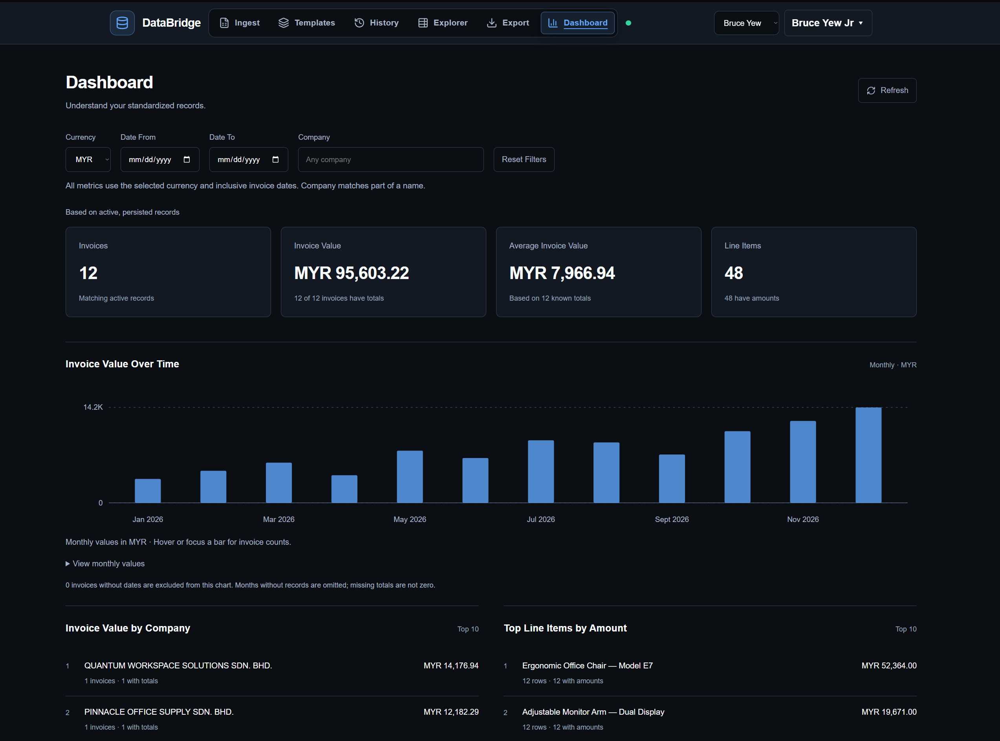
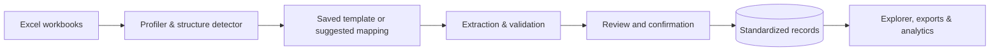
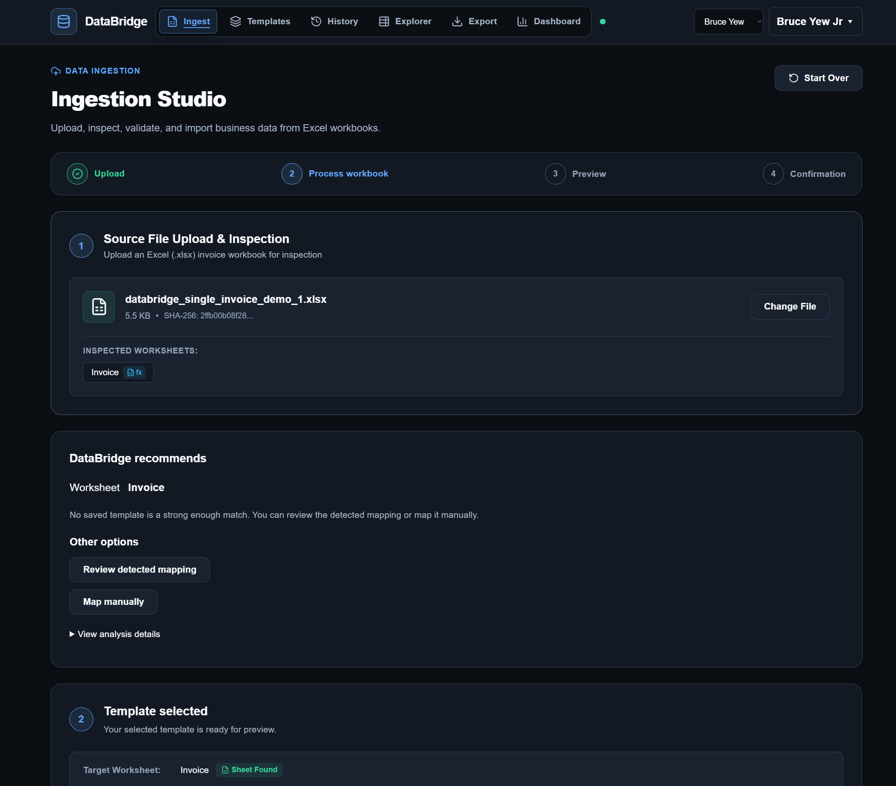
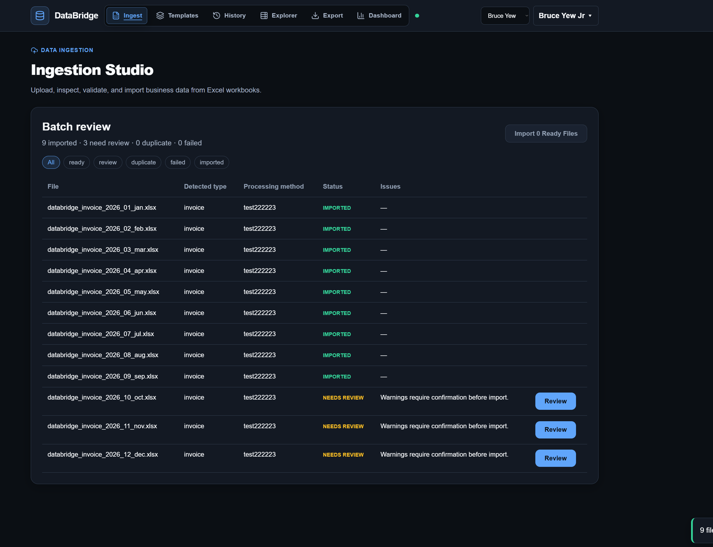
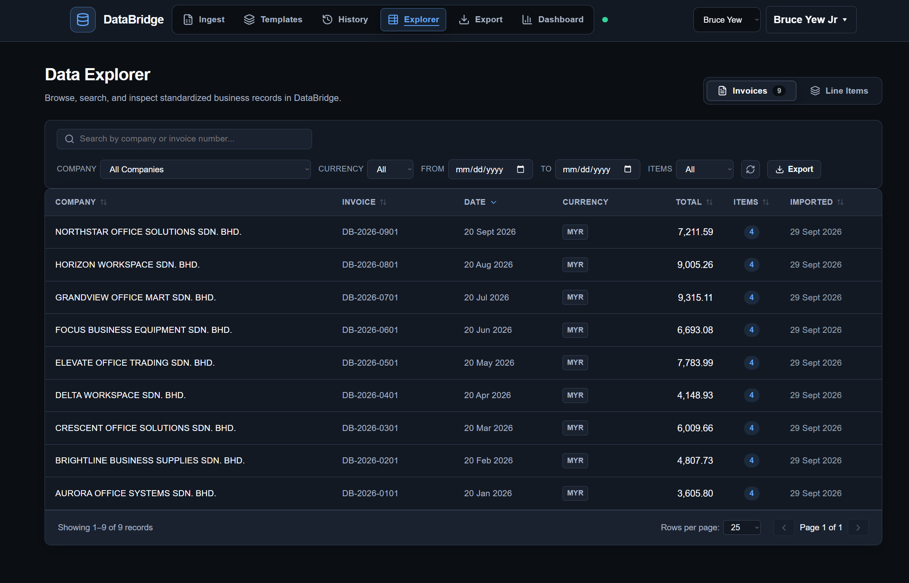
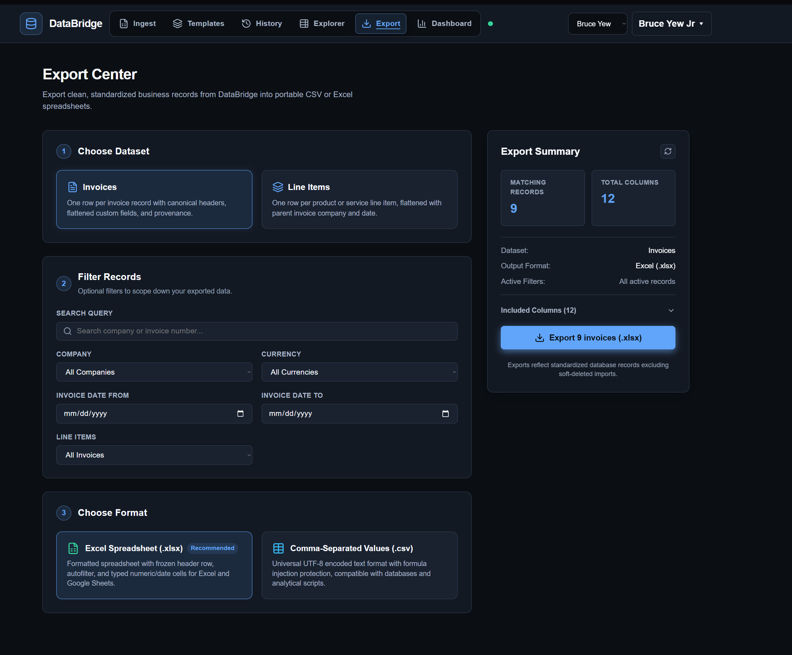
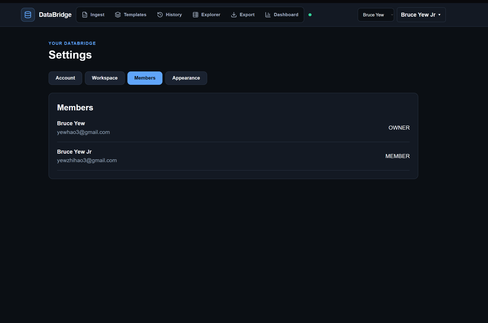
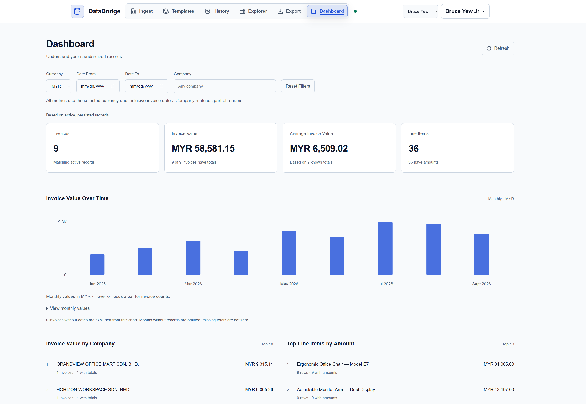

# DataBridge

**Business data ingestion, standardization, and analytics for messy Excel workflows.**

DataBridge turns inconsistent business workbooks into standardized, searchable, exportable records. Upload an XLSX invoice or dataset, let deterministic structure detection propose a mapping or match a saved template, review validation results, and import clean records for exploration and analytics.



## What it does

### Ingestion and extraction

- Upload and inspect XLSX workbooks with bounded previews and safe archive checks.
- Create reusable **invoice** and **dataset** templates for cell, column, and line-item mappings.
- Extract composite invoices with line items, or multiple dataset records from tabular sheets.
- Use deterministic smart suggestions for worksheet, structure, canonical fields, line-item tables, and saved-template matches.
- Review provenance, validation warnings, and duplicate findings before committing data.

### Batch workflow

- Upload up to 25 XLSX files in one session, including mixed invoice and dataset layouts.
- Each file is independently profiled, template-matched, validated, and marked **Ready**, **Needs Review**, **Duplicate**, **Failed**, **Imported**, or **Skipped**.
- Import ready files without losing warning files; pending reviews persist across navigation and refresh.
- Reuse the authoritative extraction, validation, duplicate-checking, and atomic persistence pipeline for every file.

### Explore, export, and analyze

- Search and filter imported records in Data Explorer, inspect invoice detail and line items, and safely edit supported record data.
- Export data as CSV or XLSX through Export Center.
- View dashboard summaries, trends, rankings, and filters scoped to the active workspace.

### Workspace product foundations

- Register accounts and create or switch between workspaces.
- Collaborate with **OWNER**, **ADMIN**, and **MEMBER** roles, plus copyable invitation links.
- Enforce workspace membership and tenant-scoped queries on the backend.
- Review audit events, manage account/workspace settings, and choose Light, Dark, or System mode in Orange, Blue, or Emerald themes.

## How it works


```mermaid
flowchart LR
    A[Excel workbooks] --> B[Profiler & structure detector]
    B --> C[Saved template or suggested mapping]
    C --> D[Extraction & validation]
    D --> E[Review and confirmation]
    E --> F[(Standardized records)]
    F --> G[Explorer, exports & analytics]
```

DataBridge uses a layered Vue/FastAPI application. Workbook services remain separate from HTTP and persistence concerns, so the same extraction and validation rules are used for previews, single-file imports, and batch confirmations.

```text
Vue 3 / Vite → FastAPI → domain services → SQLAlchemy → SQLite / PostgreSQL
Workbook → profiler → structure detector → template matcher → extractor → validator → persistence
```

## Smart extraction, without AI claims

Smart extraction is deterministic and heuristic-based—not AI. It analyzes workbook structure to suggest a worksheet, canonical field mappings, and likely line-item tables. It can also score saved templates against the workbook. Confidence labels guide the user: strong saved-template matches can become ready for batch import, while uncertain mappings remain review-first. Users can inspect the suggestions, choose a template, and edit mappings manually; the existing extraction and validation pipeline remains authoritative.

## Batch import in practice

1. Select multiple XLSX files in Ingestion Studio.
2. DataBridge analyzes each file independently and applies deterministic template matching.
3. Review the file-level state: Ready files can import immediately; warnings and uncertain layouts stay available for review; failures expose their error state.
4. Confirm Ready files, or open a persisted Needs Review item to inspect warnings and accept them when appropriate.

The batch coordinator does not fabricate import records before confirmation. Each confirmed file has its own transaction, so a failure does not partially import that file or undo other successful files.

## Screenshots

### Smart extraction



### Batch review



### Data Explorer



### Export Center



### Workspace members



### Light mode



## Technology

| Area | Implementation |
| --- | --- |
| Frontend | Vue 3, TypeScript, Vite, Vue Router |
| Backend | Python, FastAPI, Pydantic, SQLAlchemy |
| Workbook processing | openpyxl |
| Development database | SQLite |
| Production target | PostgreSQL via `psycopg` |
| Schema migrations | Alembic |
| Delivery foundation | Docker, Docker Compose, nginx |
| Tests | pytest, pytest-asyncio, HTTPX |

## Local setup

### Prerequisites

- Python 3.11+
- Node.js and npm
- Git

```bash
git clone https://github.com/yewzhihao3/DataBridge.git
cd DataBridge

# Backend (PowerShell)
python -m venv backend/.venv
backend/.venv/Scripts/Activate.ps1
pip install -r backend/requirements-dev.txt
Copy-Item backend/.env.example backend/.env

# Frontend
cd frontend
npm ci
cd ..
```

Apply the schema before starting the API:

```bash
cd backend
alembic upgrade head
cd ..
```

Start both applications from the repository root:

```bash
npm run dev
```

The launcher expects `backend/.venv`, starts FastAPI at `http://localhost:8000`, and starts Vite at `http://localhost:5173`. Stop both with `Ctrl+C`.

### Run services separately

```bash
# repository root
npm run dev:backend
npm run dev:frontend
```

Or run the underlying commands from their own folders:

```bash
# backend
uvicorn app.main:app --reload --host 0.0.0.0 --port 8000

# frontend
npm run dev
```

When the API is running in development, interactive documentation is available at `http://localhost:8000/docs`.

## Database and deployment

SQLite is supported for local development through `DATABASE_URL=sqlite:///./databridge.db`. PostgreSQL is the intended deployment target; set a PostgreSQL SQLAlchemy URL in the environment and apply Alembic migrations as a single deployment step before starting application workers.

The included Compose stack defines PostgreSQL, FastAPI, and an nginx-served frontend. Create a root `.env` with `POSTGRES_PASSWORD`, then run:

```bash
docker compose up --build
```

See [docs/deployment.md](docs/deployment.md) for configuration, migration, and staging guidance. The Compose configuration and PostgreSQL DDL are checked, but live Docker/PostgreSQL execution has not been verified in this environment.

## Testing

Run the backend regression suite from `backend/`:

```bash
python -m pytest tests/ -q
```

Build the frontend from `frontend/`:

```bash
npm run build
```

The test suite covers extraction and normalization, template schemas, composite and multi-record imports, batch behavior, analytics, exports, authentication, invitations, tenant isolation, migrations, and security boundaries.

## Project structure

```text
DataBridge/
├── backend/
│   ├── app/
│   │   ├── models/       # SQLAlchemy entities and workspace ownership
│   │   ├── routers/      # FastAPI API areas
│   │   ├── schemas/      # Pydantic request/response contracts
│   │   └── services/     # workbook, extraction, validation, export logic
│   ├── alembic/          # versioned schema migrations
│   └── tests/            # unit and integration coverage
├── frontend/src/
│   ├── views/            # product pages
│   ├── components/       # ingestion, explorer, history, dashboard UI
│   └── services/         # API, session, and toast clients
├── docs/                 # milestone, deployment, and screenshot docs
├── scripts/dev.mjs       # one-command local launcher
└── docker-compose.yml
```

## Security notes

DataBridge uses opaque HttpOnly browser sessions, CSRF/origin validation for authenticated writes, workspace membership checks, tenant-scoped database access, and role checks. Upload handling enforces file and archive limits, workbook inspection bounds, generated storage keys, and private local storage. Audit events capture relevant workspace mutations without storing passwords, raw session/invitation tokens, workbook contents, or exports.

These are application protections, not a production-security certification. Configure HTTPS, secure cookies, explicit origins, trusted proxy behavior, backup/retention, and deployment-level resource limits before public exposure.

## Current limitations

- Ingestion accepts XLSX only; there is no PDF/image intake or OCR.
- Smart extraction is deterministic; AI-assisted mapping is not implemented.
- There is no billing, subscription, email delivery, public production deployment, or external integration layer.
- Storage is local; object storage is future work.
- Batch analysis is synchronous and does not use distributed workers.
- Live PostgreSQL and Docker stack execution remain to be verified in a deployment environment.

## Roadmap

- PDF/image and OCR-based intake
- AI-assisted handling of ambiguous mappings
- Object storage and production deployment verification
- External integrations and subscription capabilities

## Further reading

- [Milestone 13: batch import and interaction feedback](docs/milestone-13.md)
- [Milestone 12.5: SaaS UX and developer experience](docs/milestone-12.5.md)
- [Milestone 12: workspace architecture and security](docs/milestone-12.md)
- [Deployment guide](docs/deployment.md)
